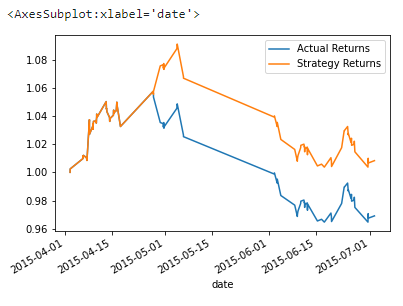
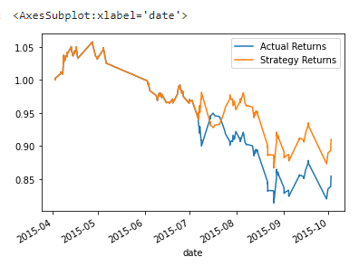
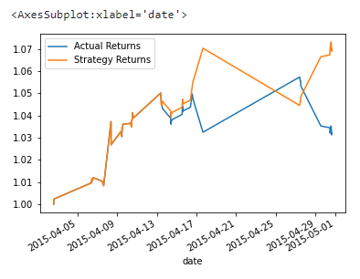
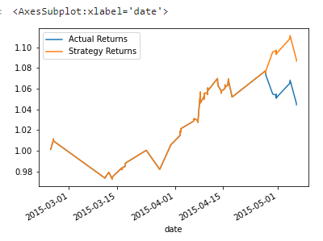
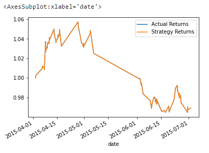
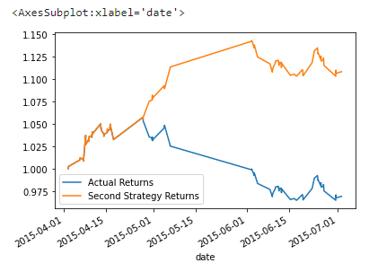
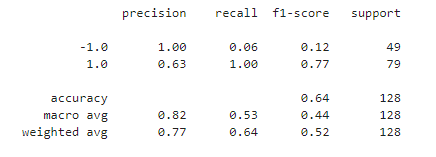
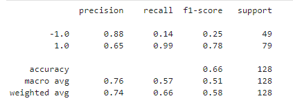

# Algorithmic_Trading

This project concerns creating a machine learning trading bot.

## Instructions:

The project is divided into the following steps:

* Establish a Baseline Performance

* Tune the Baseline Trading Algorithm

* Evaluate a New Machine Learning Classifier

* Create an Evaluation Report

#### Establish a Baseline Performance

This section establishes a baseline performance for the trading algorithm. 

1. Import the OHLCV dataset into a Pandas DataFrame.

2. Generate trading signals using short- and long-window SMA values. 

3. Split the data into training and testing datasets.

4. Use the `SVC` classifier model from SKLearn's support vector machine (SVM) learning method to fit the training data and make predictions based on the testing data. Review the predictions.

5. Review the classification report associated with the `SVC` model predictions. 

6. Create a predictions DataFrame that contains columns for “Predicted” values, “Actual Returns”, and “Strategy Returns”.

7. Create a cumulative return plot that shows the actual returns vs. the strategy returns. Save a PNG image of this plot. This will serve as a baseline against which to compare the effects of tuning the trading algorithm.

##### Results: 

The trading algorithm provided greater returns compared to the actual returns:

#### Tune the Baseline Trading Algorithm

1. Tune or adjust the model’s input features to find the parameters that result in the best trading outcomes.

Increasing the training dataset to 6 months resulted in the trading algorithm continuing to outperforming the actual returns, but overall providing lower returns than the training dataset of 3 months:

However, decreasing the training dataset to 1 months resulted in the trading algorithm providing the greatest returns of any model so far:

2. Tune the trading algorithm by adjusting the SMA input features. Adjust one or both of the windows for the algorithm. Rerun the notebook with the updated parameters, and record the results in your `README.md` file. Answer the following question: What impact resulted from increasing or decreasing either or both of the SMA windows?

The training dataset was reset to 3 months and the rolling average long window was halved to 50 days. This resulted in the algorithm strategy once again outperforming the actual returns:

Increasing the short window always caused the returns to equal eachother. Here is the short window rolling average increased to 30 days, while the long window remaind at 100 days:

3. Choose the set of parameters that best improved the trading algorithm returns.

The 50 day rolling average for the long window with the 3 month training dataset provided the greatest returns of all the other algorithms:

#### Evaluate a New Machine Learning Classifier

Use the original parameters that the starter code provided. But, you’ll apply them to the performance of a second machine learning model. To do so, complete the following steps:

1. Import a new classifier, such as `AdaBoost`, `DecisionTreeClassifier`, or `LogisticRegression`. (For the full list of classifiers, refer to the [Supervised learning page](https://scikit-learn.org/stable/supervised_learning.html) in the scikit-learn documentation.)

2. Using the original training data as the baseline model, fit another model with the new classifier.

3. Backtest the new model to evaluate its performance. Save a PNG image of the cumulative product of the actual returns vs. the strategy returns for this updated trading algorithm, and write your conclusions in your `README.md` file. Answer the following questions: Did this new model perform better or worse than the provided baseline model? Did this new model perform better or worse than your tuned trading algorithm?

The logistic regression model with the original parameters provided the greatest returns thus far: 

#### Evaluation Report

Although the logistic regression model provided the greatest returns when using the original parameters, the accuracy of it was slightly lower then the SVM model (74% weighted average vs. 77% weighted average:

I would continue to use the SVM model using the original parameters even though it provided slightly less returns, just for the sake of higher accuracy.